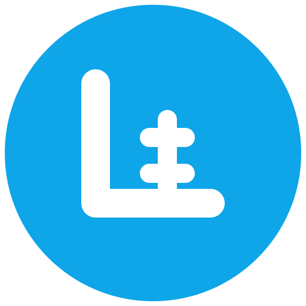

# 🏪 Ledgerly

<div align="center">



A modern full-stack application for managing store sales and payments.

[](backend/README.md)
[](frontend/README.md)

</div>

## 📖 About

Ledgerly is a store management system designed to help small businesses track their sales and payments. Originally created for my mother's store, it has been open-sourced as a portfolio project. Because of the nature of the project, the values, numbers and names are brazilian, so it's not a good example for international use.

## 📝 Demo

You can see the live demo [here]() //coming soon.

## 📝 Demo Users

```
Owner:
  Email: owner@example.com
  Password: owner123

Manager:
  Email: manager@example.com
  Password: manager123

Employee:
  Email: employee@example.com
  Password: employee123
```

### Key Features

- 🔐 Role-based authentication (Owner, Manager, Employee)
- 📊 Real-time sales dashboard
- 👥 Client management with payment history
- 💰 Sales tracking with installment support
- 💵 Payment control and balance tracking
- 📱 Responsive design for all devices
- 🌐 Modern and intuitive interface

## 🚀 Tech Stack

### Backend

- Node.js with Fastify
- PostgreSQL with Prisma ORM
- JWT Authentication
- Docker containerization

### Frontend

- Next.js 15
- Tailwind CSS
- React Context + Hooks
- TypeScript

## 🛠️ Quick Start

### Prerequisites

- Docker and Docker Compose
- Node.js 18+
- Yarn package manager

### Running the Project

1. Clone the repository:

   ```bash
   git clone https://github.com/yourusername/ledgerly.git
   cd ledgerly
   ```

2. Run the Docker build and seed the database, necessary for the initial setup.

   ```bash
   yarn docker:build  # Builds the Docker image for the project
   yarn seed          # Populates the database with initial data
   ```

3. If you have problem with node modules, you can run the following command to install them.

   ```bash
   yarn install # Install the backend and frontend dependencies
   ```

4. Access the application:

   - Frontend: http://localhost:3000
   - Backend API: http://localhost:5050
   - Prisma Studio: http://localhost:5555

5. For the next time you just need to run the following command to start the project.

   ```bash
   yarn docker:up
   ```

6. If you want to stop the project, you can run the following command.

   ```bash
   yarn docker:down
   ```

## 📚 Documentation

- [Backend Documentation](backend/README.md)

  - API endpoints
  - Database schema
  - Authentication
  - Docker setup

- [Frontend Documentation](frontend/README.md)
  - Components
  - State management
  - Routing
  - Styling

## 🛠️ Useful Commands

- `yarn docker:build` - Builds the Docker image for the project.
- `yarn seed` - Populates the database with initial data.
- `yarn docker:up` - Starts the Docker container for the project.
- `yarn docker:down` - Stops the Docker container for the project.
- `yarn install` - Installs the project dependencies.

## 🎯 Project Structure

```
ledgerly/
├── backend/              # Fastify API
│   ├── src/             # Source code
│   ├── prisma/          # Database schema and migrations
│   └── docker/          # Docker configuration
│
├── frontend/            # Next.js application
│   ├── src/            # Source code
│   ├── public/         # Static files
│   └── components/     # React components
│
└── docs/               # Documentation files
```

## 🤝 Contributing

1. Fork the repository
2. Create your feature branch (`git checkout -b feature/AmazingFeature`)
3. Commit your changes (`git commit -m 'Add some AmazingFeature'`)
4. Push to the branch (`git push origin feature/AmazingFeature`)
5. Open a Pull Request

## 📝 License

This project is licensed under the MIT License - see the [LICENSE](LICENSE) file for details.

## 🙏 Acknowledgments

- My mother, for inspiring this project
- The open-source community for amazing tools
- All contributors and users of Ledgerly

```

```
